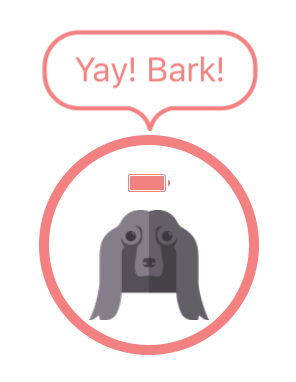

# SwiftSpeechBubble
Speech Bubble view you can attach to the top of other views.  
Styles (padding, corner radius, border width, etc) adjust automatically depending on the font size.



## Usage
```
  let bubbleView = SpeechBubble(baseView: buttonView, text: "Yay! Bark!", fontSize: 16.0)
  parentView.addSubview(bubbleView)
```

## Referece
It's a library developed for Bark project: [Bark - Don't speak, Let's bark!](https://barkapp.co).  
This code is available under the MIT license.
